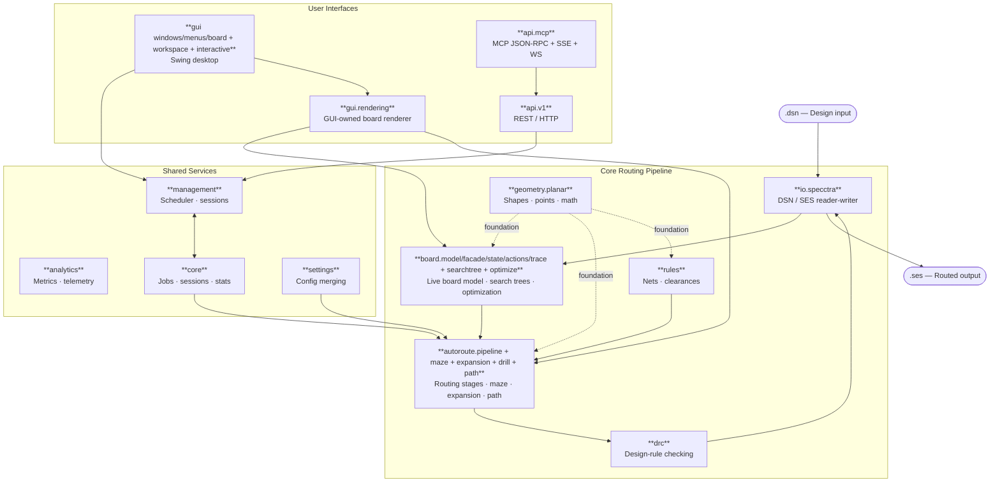

# Freerouting Architecture Map

> **HISTORICAL (M10-T4 Java sunset, 2026-09-30):** the Java tree this map describes (`src/`, `src_v19/`, gradle) was deleted at M10-T4. **The Rust workspace (`rust/`) is the product** — see the "Rust Workspace (EpicRouter)" section below; the Java faces (Mermaid diagram, package glossary, boundaries, debt ledger) are preserved below UNTOUCHED as the historical record of the engine the Rust crates port. Code lives in git history and upstream (`freerouting/freerouting`, grafted here as `origin/master` at `e7f9bdf1`); the parity record lives in the committed goldens.

This document provides a concise map of the current codebase for contributors and maintainers. It highlights the principal packages, the repository layout, and the fastest path to the code that owns a given behavior.

For long-term structural recommendations, see [docs/research/code_structure_recommendations.md](research/code_structure_recommendations.md). For the active GUI/headless separation plan and boundary-debt ledger, see [docs/issues/soc-gui-separation-and-accessibility-plan.md](issues/soc-gui-separation-and-accessibility-plan.md).

## System Overview

The runtime flow is:

`DSN input -> parser -> board and rule model -> autorouter -> design-rule checking -> SES output`

The GUI, API, and job scheduler all build on this core pipeline. When investigating a feature or defect, begin with the package that owns the data model or behavior, then follow the call chain outward.

## Repository Layout

| Path | Purpose |
| --- | --- |
| `src/main/java/app/freerouting/` | Production Java sources for routing, UI, API, loading, settings, and support code. |
| `src/test/java/app/freerouting/` | JUnit tests, including real-board fixture tests and package-level unit tests. |
| `src/main/resources/` | Localized strings and runtime resources loaded at startup. |
| `fixtures/` | DSN boards and related inputs used by regression tests and debugging. |
| `docs/` | User documentation, developer notes, issue analyses, and design references. |
| `integrations/` | Packaging and integration assets for external PCB tool workflows. |
| `scripts/` | Automation, benchmarking, and comparison scripts. |
| `src_v19/` | The v1.9 historical reference tree, used for optional algorithm archaeology; it is not the routine parity baseline. |
| `rust/` | EpicRouter Rust rewrite workspace: parity crates (geometry, DSN/SES I/O, board model, spatial index, detail-routing router, DRC, headless CLI) plus the differential harness against the Java oracle; see [rust/README.md](../rust/README.md). |

## Navigation Guide

Use the table below to jump to the package most likely to own the behavior you are investigating.

| If you are working on... | Start with... |
| --- | --- |
| DSN / SES file loading or writing | `app.freerouting.io.specctra` |
| Board items, board state, or board-level helpers | `app.freerouting.board.model.items`, `app.freerouting.board.model.structure`, `app.freerouting.board.facade`, `app.freerouting.board.state`, `app.freerouting.board.actions`, and `app.freerouting.board.trace` |
| Routing decisions, fanout, maze search, or optimization | `app.freerouting.autoroute.pipeline`, `app.freerouting.autoroute.maze`, `app.freerouting.autoroute.expansion`, `app.freerouting.autoroute.drill`, `app.freerouting.autoroute.path`, and `app.freerouting.board.optimize` |
| Nets, vias, clearance classes, or board rules | `app.freerouting.rules` |
| Clearance violations or design-rule checks | `app.freerouting.drc` |
| GUI windows, panels, menus, editor state, or drawing | `app.freerouting.gui.windows.board`, `app.freerouting.gui.windows.routing`, `app.freerouting.gui.menus`, `app.freerouting.gui.board`, `app.freerouting.gui.controls`, `app.freerouting.gui.support`, `app.freerouting.gui.workspace`, `app.freerouting.gui.interactive`, and `app.freerouting.gui.rendering` |
| API endpoints or background job execution | `app.freerouting.api.v1` and `app.freerouting.management` |
| MCP server protocol bridge | `app.freerouting.api.mcp` |
| Runtime settings and settings sources | `app.freerouting.settings` |
| Router or optimizer board scores | `app.freerouting.core.scoring` (`BoardStatistics.getRouterScore` / `getOptimizerScore`) |
| Geometry, shapes, points, and planar math | `app.freerouting.geometry.planar` |

## Module Boundaries (ArchUnit)

Architectural boundaries are codified in `src/test/java/app/freerouting/architecture/ModuleBoundariesArchTest.java`.

- **Strict boundaries (must pass):**
  - Core routing/model packages (`autoroute`, `board`, `rules`, `drc`, `geometry`) must not depend on GUI/editor or API packages.
  - API/management packages must not depend on `gui` or `gui.rendering`.
  - Headless paths (`api`, `management`, `core`) must not depend on `GuiBoardManager` or `InteractiveState`.
- **Strict boundaries (continued):**
  - `gui.interactive` concrete state classes should not be used outside the GUI layer.
  - `gui.workspace` owns the opaque editor-state handles, events, commands, manager, settings, messages,
    and action threads; it must not depend on `gui.interactive`.
  - `board` and `autoroute` must not depend on `gui.rendering`; rendering is GUI-owned.
  - Pipeline/support packages must not depend on Swing or non-geometry AWT UI types.
  - `io.specctra.parser` internals must not be depended on outside `io.specctra` public I/O entry points.

The only intentional GUI boundary exception is the documented D26 `gui.workspace` →
`gui.rendering` dependency used by `GuiBoardManager` for its graphics context state. These
boundaries are strict ArchUnit rules; no frozen violation store is required.

## Accepted architectural debt

- `board.actions.ItemInfoPrinter` remains a presentation-shaped writer API; converting it to DTOs is
  outside this initiative.
- Incomplete-connection computation remains under `drc`; the package name is broader than
  clearance checking by design.
- `gui.workspace` may depend on `gui.rendering` for the `GuiBoardManager` graphics context (D26);
  moving that state fully into views is outside this initiative.
- `gui.board`, `gui.windows.*`, `gui.menus`, and `gui.controls` retain bidirectional `BoardFrame`
  owner references after the Phase 8 split; ArchUnit cycle checks apply to
  `gui.workspace` / `gui.interactive` / `gui.rendering` only.

## Package Glossary

### `app.freerouting`

Application bootstrap and top-level wiring. Start here when you need the entry point for the program, [Freerouting.java](src/main/java/app/freerouting/Freerouting.java).

### `app.freerouting.io.specctra`

Import and export for board files. The public DSN and SES entry points are in this package, and parser internals live in `io.specctra.parser`.

### `app.freerouting.board`

The live board model is split into cohesive subpackages. There are no remaining Java sources in the
`board` root package.

- `board.model.items` — pins, vias, traces, conduction areas, keepouts, and connectivity.
- `board.model.structure` — layers, outline, components, units, and fixed-state.
- `board.trace` — polyline-trace geometry, normalization, and search-tree adaptation.
- `board.facade` — `BasicBoard`, `RoutingBoard`, and repository/snapshot/search/undo façades.
- `board.state` — observers, communication, changed-area, coordinate transform, and comparison.
- `board.actions` — forced routing, item inspection/selection, drill-item moves, and ID generation.

Start with [BasicBoard.java](src/main/java/app/freerouting/board/facade/BasicBoard.java) and
[RoutingBoard.java](src/main/java/app/freerouting/board/facade/RoutingBoard.java).

### `app.freerouting.board.searchtree`

Board search-tree implementations and their manager/trace-entry support. These trees index board
items for clearance and overlap queries and remain headless.

### `app.freerouting.board.optimize`

Board trace-pull-tight, shove, and via-optimization implementations. The package contains
algorithmic board mutation helpers and has no GUI dependency.

### `app.freerouting.autoroute.pipeline`

Routing orchestration and stage implementations: fanout, batch autorouting, optimization, pipeline
lifecycle, and per-pass autorouter workers.

### `app.freerouting.autoroute.maze`

Maze-search control, engine, distance/list elements, and maze trace-shoving support.

### `app.freerouting.autoroute.expansion`

Expansion rooms, doors, and angle-specific room-neighbour calculations used by maze routing.

### `app.freerouting.autoroute.drill`

Drill-page indexing and expansion-drill support used during maze expansion.

### `app.freerouting.autoroute.path`

Found-connection reconstruction and insertion, including path connection value objects.

### `app.freerouting.autoroute`

Remaining autoroute support types and routing diagnostics. The implementation families are kept in
the dedicated subpackages above; `app.freerouting.autoroute.events` remains the event boundary.

### `app.freerouting.rules`

The rule model that defines nets, clearance classes, via rules, and layer constraints.

### `app.freerouting.drc`

Design-rule checking and violation reporting. Use this package when you need to understand why a routed board is still invalid.

### `app.freerouting.geometry.planar`

Planar geometry primitives and helper classes used throughout routing and board operations.

### `app.freerouting.gui`

The Swing user interface is split into cohesive subpackages. There are no remaining Java sources in
the `gui` root package.

- `gui.windows.board` — board/information windows (`WindowAbout`, `WindowNets`, `WindowVisibility`).
- `gui.windows.routing` — routing, rules, clearance, via, and autoroute windows.
- `gui.menus` — board menus and popup menus (`BoardMenuBar`, `BoardMenuFile`, `PopupMenuMain`).
- `gui.board` — board shell and frame classes (`BoardFrame`, `BoardPanel`, `GuiManager`, toolbars).
- `gui.controls` — reusable controls (`ColorManager`, combo boxes, progress controls).
- `gui.support` — GUI defaults, text, and progress support (`GuiDefaultsFile`, `GuiTextManager`).

Accessibility coverage uses the frame-free component seams in `BoardMenuBar`, `BoardToolbar`, and
`WindowVisibility`; these keep menu, toolbar, and settings workflows testable under forced
headless mode without creating top-level windows.

### `app.freerouting.gui.interactive`

Concrete GUI editor states and their controller implementation. States implement the workspace-owned
opaque handle/command contracts; views register the controller and bootstrap the initial route-menu
state.

### `app.freerouting.gui.workspace`

The GUI board workspace boundary. The root package is a compatibility façade with `GuiBoardManager`,
`WorkspaceContract`, and `WorkspaceSettings`. Collaborators live in `gui.workspace.controllers`,
`gui.workspace.session`, `gui.workspace.ports`, and `gui.workspace.progress` (`ScreenMessages`,
`GuiRoutingJobWorker`, ratsnest, and route-progress façades). This package owns no
concrete editor state and has no dependency on `gui.interactive`; GUI views perform initial-state
registration.

### `app.freerouting.api`

HTTP API controllers, filters, and server-facing request handling. The concrete REST endpoints live in `api.v1`, MCP server infrastructure lives in `api.mcp`, supporting DTOs are in `api.dto`, authentication in `api.security`, and developer-only mocks in `api.dev`.

### `app.freerouting.analytics`

Analytics telemetry and metrics dispatch (`FRAnalytics`, `BigQueryClient`, `SegmentClient`, and event DTOs).

### `app.freerouting.io`

Board and design file input/output serialization, parsing, and multi-format generation. Specific formats include Specctra (`io.specctra`), KiCad JSON (`io.kicad`), and multi-output synthesis (`MultiOutputGenerator`).

### `app.freerouting.management`

Headless board management (using `BoardManager` and `HeadlessBoardManager`), composite board input assembly (`CompositeBoardInput`), board loading (`BoardLoader`), job scheduling (`management.jobs`), and session lifecycle management (`management.sessions`).

### `app.freerouting.core`

Shared application data such as routing jobs, sessions, scoring (`core.scoring`), CLI result
manifests (`core.results`), and board library definitions (`core.library`).

### `app.freerouting.settings`

Application configuration, defaults, and the priority-based `SettingsMerger`. Stage knobs live under `router.fanout`, `router.autorouter`, and `router.optimizer`; `max_threads` stays on the parent `router` object.

### `app.freerouting.datastructures`

Reusable support structures that are shared across feature areas.

### `app.freerouting.logger`

Logging helpers and the `FRLogger` entry point.

### `app.freerouting.debug`

Diagnostics and debugging utilities.

### `app.freerouting.gui.rendering`

GUI-owned board rendering: layer/virtual-layer ordering, viewport culling, draw-priority traversal,
component fabrication labels, dispatch to board-item paint strategies, and adaptation of opt-in
headless autorouter diagnostic snapshots. `BoardRenderer` and `AutorouteDiagnosticRenderer` are the
GUI rendering entry points; `BasicBoard` and `autoroute` remain headless and do not own GUI painting.

### Notable Nested Packages

Several implementation areas live one level below the top-level package grouping above:

- `app.freerouting.geometry.planar` contains the actual planar primitives and helper classes; start with [Point.java](src/main/java/app/freerouting/geometry/planar/Point.java) and [Shape.java](src/main/java/app/freerouting/geometry/planar/Shape.java).
- `app.freerouting.io.specctra` contains DSN and SES import/export; parser internals live in `parser/`. Start with [DsnReader.java](src/main/java/app/freerouting/io/specctra/DsnReader.java), [DsnWriter.java](src/main/java/app/freerouting/io/specctra/DsnWriter.java), [SesReader.java](src/main/java/app/freerouting/io/specctra/SesReader.java), and [SesWriter.java](src/main/java/app/freerouting/io/specctra/SesWriter.java).
- `app.freerouting.analytics` contains analytics telemetry and dispatch; start with [FRAnalytics.java](src/main/java/app/freerouting/analytics/FRAnalytics.java).
- `app.freerouting.util.gson` contains Gson adapters and JSON provider helpers; start with [GsonProvider.java](src/main/java/app/freerouting/util/gson/GsonProvider.java).
- `app.freerouting.core.scoring` contains board statistics and scoring helpers; start with [BoardStatistics.java](src/main/java/app/freerouting/core/scoring/BoardStatistics.java).
- `app.freerouting.core.results` contains the headless CLI routing result manifest; start with [RoutingResultManifest.java](src/main/java/app/freerouting/core/results/RoutingResultManifest.java).
- `app.freerouting.api.v1`, `app.freerouting.api.dto`, `app.freerouting.api.security`, and `app.freerouting.api.dev` contain the public controllers, payloads, authentication, and mocked endpoints; start with [JobControllerV1.java](src/main/java/app/freerouting/api/v1/JobControllerV1.java), [BoardFilePayload.java](src/main/java/app/freerouting/api/dto/BoardFilePayload.java), and [ApiKeyValidationService.java](src/main/java/app/freerouting/api/security/ApiKeyValidationService.java).
- `app.freerouting.autoroute.events` contains routing event callbacks; start with [BoardUpdatedEvent.java](src/main/java/app/freerouting/autoroute/events/BoardUpdatedEvent.java).
- `app.freerouting.autoroute.pipeline` contains the shared routing sequencer; start with [RoutingPipeline.java](src/main/java/app/freerouting/autoroute/pipeline/RoutingPipeline.java).
- `app.freerouting.board.searchtree` contains board spatial indexes; start with [SearchTreeManager.java](src/main/java/app/freerouting/board/searchtree/SearchTreeManager.java).
- `app.freerouting.board.facade` keeps board services behind the stable `BasicBoard` and `RoutingBoard`
  façades: item storage/connectivity/snapshots, routing operations/search, and routing undo/redo.
- `app.freerouting.gui.windows.board` and `app.freerouting.gui.windows.routing` contain the Swing
  information and routing-parameter windows; start with [WindowVisibility.java](src/main/java/app/freerouting/gui/windows/board/WindowVisibility.java) and [WindowAutorouteParameter.java](src/main/java/app/freerouting/gui/windows/routing/WindowAutorouteParameter.java).
- `app.freerouting.gui.board` contains the board shell; start with [BoardFrame.java](src/main/java/app/freerouting/gui/board/BoardFrame.java).

### Rust Workspace (EpicRouter)

The `rust/` tree is the ground-up Rust rewrite of the routing engine
([design](superpowers/specs/2026-09-11-epicrouter-rust-rewrite-design.md));
the Java packages above were the frozen parity oracle until the rewrite's
final milestone — at M10 the oracle was sunsetted (the Java tree deleted,
history preserved in git history and the grafted `origin/master` at
`e7f9bdf1`) and the Rust workspace became the product, released as
**v2.0.0** with the Linux release artifact and the
[migration guide](migration-guide.md) (Freerouting → EpicRouter 2.0).
The milestone is **CLOSED-ADJUDICATED: `M10_EXIT_WITH_DEVIATIONS`** (the
2026-10-01 terminal adjudication; all six exit criteria MET, the carry rows
riding post-2.0 with named owners) — the filled verdict sits in design §6's
M10 exit note.
Crates enter this map as their milestones complete
(M0–M4 done — M4 exited M4_EXIT_WITH_DEVIATIONS; M5 executed on top:
arena/SoA allocation slices + deterministic per-net parallelism, closed
M5_EXIT_WITH_DEVIATIONS; M6 executed on top: the routing-intelligence
family — congestion map + global planning, PathFinder negotiated
congestion, push-and-shove insertion, floating-island detection + the
plane-island clamp, the plane-routing parity audit — all behind
default-off settings, with byte-invariance at defaults held throughout
(census 1497/0/17, canaries unrotated); the CI router gate FLIPPED at M8-T8
(`--report-only` dropped after four holds — the post-flip face is
11 green / 0 red at Σ 286.5 s, `logs/M8-T8/`); crafted DSNs stay
comment-free pending bug-186 (M1b-reopen); design §6 M4/M5/M6 exit
notes, `logs/M6-T10/report-t10.md`;
commands and parity gates: [rust/README.md](../rust/README.md)).

- `rust/crates/epic-board` — arena board model: ItemId/undoable-object
  storage, item geometry, trace combine/split/normalize, and the
  snapshot/undo facade (33/33 replay parity vs the Java oracle); the
  M6 floating-island detector (`src/islands.rs`, advisory manifest
  face + the region-seeded clamp helper).
- `rust/crates/epic-index` — incremental spatial index (ShapeTree,
  MinAreaTree, tree-shape precalc) — the Rust counterpart of
  `board.searchtree` (33/33 query-set parity).
- `rust/crates/epic-router` — detail-routing core: expansion
  rooms/doors, maze search, ripup/shove, found-connection locator,
  forced insertion, batch driver, fanout and optimizer stages, and the
  full-pipeline assembly (`pipeline/full.rs`, the
  `RoutingPipeline.run()` equivalent); the M6 global-planning stage
  (`src/global/`: congestion map, per-net guides + planned net order,
  pattern routing, PathFinder history costs) and the push-and-shove
  insertion arm ride default-off settings — the Rust counterpart of
  `autoroute.*` plus the beyond-Java M6 intelligence family; port
  ledger in [SEAM.md](../rust/crates/epic-router/SEAM.md).
- `rust/crates/epic-drc` — incompletes + clearance counting — the Rust
  counterpart of `drc`.
- `rust/crates/epic-cli` — headless `route` command (`epicrouter -de
  board.dsn -do out.ses`) — the counterpart of the Java CLI surface.
- `rust/crates/epic-engine` — the headless application core (the
  counterpart of the Java `HeadlessBoardManager` role): the layered
  settings face (defaults→DSN→CLI→session, the Java `SettingsMerger`
  precedence — moved here from epic-cli at M9-T1) plus the `Session`
  (load→settings→route→cancel→export over the exact `run_route`
  prelude), the versioned `EngineEvent` stream with the `TeeDriverSink`
  (parity-stream forwarding pinned byte-safe), and `BoardSnapshot` with
  the overlay data faces (ratsnest/DRC markers/congestion/tuning). The
  CLI path never constructs the session or the tee — default-path-inert
  by construction.
- `rust/crates/epic-gui` — the GUI layer as a pure projection + thin
  host: the headless view core (`ViewModel → RenderList`, committed
  goldens, always compiled) plus the desktop shell (eframe/rfd behind
  the DEFAULT-OFF `desktop` feature — worker thread over the engine
  `Session`, canvas, panels, dialogs; no geometry logic). Structural
  law: the GUI renders, never mutates (no `&mut Board` surface; board
  access is `&Board` read faces through the session/engine event
  stream). CI posture: compile-gated only (desktop-clippy,
  tripwire-pinned) — the default workspace build stays egui/wgpu-free.
- `rust/harness` — differential parity + benchmark harness: the
  java-free compare gates (geometry corpus, DSN/SES, index, undo, DRC,
  events), the router-compare battery (router-only default + the
  `--profile full` M4 face vs the committed Java records — Tier A
  router-only records under `baselines/router-only/`, the M0 full-flow
  default-settings captures under `baselines/java/`), the determinism
  self-gate, and the CI workflow tripwire pins
  (`src/ci_tripwire.rs`).

M5 performance face (landed on top of the M4 pipeline, byte-invariant
throughout): the hot maze/expansion `BTreeMap`s, the boxed
priority-queue site, the `epic-index` slab hot path, and the
geometry/rational churn sites were allocation-eliminated (M5-T4–T6
dossiers in [SEAM.md](../rust/crates/epic-router/SEAM.md)); the
optimizer stage gained Java's two-face stop semantics so completed
boards reach it (M5-T1b, `bb37cc2e2`); and the batch pass loop runs on
a deterministic per-net partitioned executor behind `--threads`
(`epic-router` `pass_runner.rs`: fixed net-ID partitioning, per-worker
reply channels) with `--threads N` byte-identical to `--threads 1`
(pinned in-tree; CI wiring deferred to the M6 flip moment). The CI
flip outcome is an honest hold (second consecutive; composition
changed — the maze-search wall collapsed, the residual is the bm01
optimizer stage under the 1800 s tier plus the buglog-181 completion
residuals): design §6 M5 exit note and `logs/M5-T8/report-t8.md`.

M6 intelligence face (landed on top of the M5 engine, default-off
throughout — at DEFAULT settings every output stayed byte-identical:
census 1497/0/17 with additions only, canaries unrotated): the
congestion map + global planning stage
(`epic-router/src/global/` — `map.rs` distinct-net occupancy grid,
`plan.rs` per-net guides + planned net order, `pattern.rs` L/Z
cheap-net fast path, `history.rs` PathFinder per-resource history
costs with negotiated bases replacing the linear pass-cost ladder)
behind `router.congestion_global` (+ `.pattern` / `.pathfinder`);
push-and-shove insertion in the maze's obstacle-room arm behind
`router.push_shove` (shove-verified room rip-up charge waived,
bounded budget, deterministic order — no Java counterpart);
floating-island detection as an advisory manifest face
(`epic-board/src/islands.rs`) with the region-level connectivity
clamp behind `router.plane_island_clamp`; and the plane-routing
parity audit (T5, zero divergences — every Java plane face already
ported Java-exactly). The settings family follows the `-mt` seam
precedent: all five flags default-OFF, so settings-ON faces are NEW
goldens while the parity regime is untouched. The Tier B/C AFTER-face
(T10) measured criterion 1 at 2/12 strictly-better with the ALL-ON
regime net-harmful — the measured best-known regime is **default +
push_shove-only**; criteria 2 (Issue093-class router-introduced
violations = 0 on every completing pour fixture, real counter) and 3
(island detection, zero divergence re-confirmation) are met on the
T10 record. The CI flip stays HELD (third consecutive NO-GO at
M6-T3: Tier A 10 green / 1 red + Σ 2089.5 s > the 30-min budget;
reopen bound: the flip reopens exactly when bm01's total completes
< 1510.7 s): design §6 M6 exit note (VERDICT: M6_EXIT_WITH_DEVIATIONS,
adjudicated 2026-09-28 at tree `a6d6ac38c`), `logs/M6-T10/report-t10.md`, and the M6
criterion map in [SEAM.md](rust/crates/epic-router/SEAM.md).

M7 tuning face (landed on top of the M6 engine, INPUT-DRIVEN — a DSN
`(circuit (length …))` declaration activates the tuning faces;
constraint-free input routes byte-identically at defaults throughout,
census 1547/0/17, canaries unrotated): the length-constraint model
(`epic-board/src/rules_surf.rs` — `net_class_length_bounds` :783,
`has_length_constraints` :802, and `length_violation` :825 = Java
`calcLengthViolation` verbatim); the min-length honoring gate
(`epic-board/src/trace_tightener/mod.rs:1170` `min_length_gate_allows`,
consulted at the pull-tight acceptance `:1143` and the pin-tail rebuild
`epic-board/src/trace_tightener/pin_tail.rs:433`); the clearance-aware
meander engine (`epic-router/src/pipeline/tuning.rs` — square-wave
accordion with a fixed amplitude ladder (:150), per-site dent cap
(:156), `MATCH_TOLERANCE_DBU` (:174), and an honest-stop report face),
run as a post-optimization/pre-report stage in
`epic-router/src/pipeline/full.rs:389`; the class-constraint
match-to-target stage (the same engine, per-class goals); and the
differential-pair face (`epic-router/src/pipeline/pairs.rs` — declared
solely via the `router.tuning.pairs` settings list, the KiCad DSN
export declaring none; `PAIR_DELTA_DBU` :86, the coupling-window
discount `COUPLING_WINDOW_DBU` :93, the leader/follower match stage,
and the advisory `pair_report`/`pair_unresolved` manifest keys). The
settings family `router.tuning.*` (+ `.meander`, `.pairs`) lives in
`epic-cli/src/settings.rs` and rides the input-driven activation (the
flags are override/kill-switch only). The tuning population is the six
committed fixtures under `rust/harness/fixtures/tuning/` plus the two
pair goldens, measured DRC-clean at the REAL counter (ri=0 on all six,
T7); Tier A held 11/11 row-for-row at T7. Design §6 M7 exit note
(**M7_EXIT_WITH_DEVIATIONS**, adjudicated 2026-09-28 at `bb57d7046`),
`logs/M7-T7/report-t7.md`, and the M7
criterion map in [SEAM.md](rust/crates/epic-router/SEAM.md).

M8 gloss face (landed on top of the M7 engine, default-off throughout
— at DEFAULT settings every output stayed byte-identical, census
1629/0/17, canaries unrotated): the four-metric aesthetics measurer
(`rust/crates/epic-board/src/aesthetics.rs` — `aesthetics_metrics` at
:238, the `AESTHETICS_PARALLELISM_WINDOW_DBU` constant at :83, the
metric definitions in the module docs) with two thin doors — the
`--dump-aesthetics` sidecar on `rust/crates/epic-cli/src/route.rs`
(:1565; sidecar ONLY, never into the manifest — the canary-rotation
trap is named in the code) and the java-free harness
`aesthetics --dsn` reference door — over the committed 21-board
PCBench sample (`rust/harness/fixtures/aesthetics/sample.yaml` + 24
reference goldens); and the gloss stage family
(`rust/crates/epic-router/src/pipeline/gloss.rs` — the bus group
detector + hug/spread pass `run_gloss_bus_stage` :996, the
POST-tightener 45° flow jog/stub/miter pass :1556, the
return-path-aware via-placement pass :1806, the graded-wire teardrop
pass :2488 — slotted post-tuning in `pipeline/full.rs` :440-:492)
behind `router.gloss.bus` / `.flow` / `.via_place` / `.teardrops`
(the tri-state flags in `epic-cli/src/settings.rs`). The M8
measurement record: the two criterion-1 regression findings, the
via-density monotone violation, and the artifact-dominated bend
improvement all own to the teardrop tapers' added routed length
(flow-alone an exact no-op on the sample corpus), while criterion 2
(no completion/DRC regression) held clean; the CI router gate FLIPPED
at M8-T8 (recorded above). Design §6 M8 exit note (verdict slot OPEN,
pending adjudication), `logs/M8-T8/report-t8.md`, and the M8
criterion map in [SEAM.md](rust/crates/epic-router/SEAM.md).

## How The Code Fits Together

### Routing Path

The primary routing packages are `board`, `board.searchtree`, `board.optimize`, `autoroute.pipeline`,
`autoroute.maze`, `autoroute.expansion`, `autoroute.drill`, `autoroute.path`, `rules`, `drc`, and
`geometry.planar`.

- `board` stores the current design.
- `rules` defines what is permitted.
- `autoroute.pipeline` sequences routing stages and `autoroute.maze` chooses the next routing action.
- `drc` validates the result.
- `geometry.planar` provides the shapes and measurements used by all of the above.

When diagnosing routing behavior, start in `autoroute`, then trace the data into the board and rule objects it reads.

### Routing Algorithm

Freerouting routing is easiest to think about in two steps: first connect everything, then improve the result.

#### High-Level Overview

Freerouting has two related routing stages:

| Stage | Purpose | Board impact |
| --- | --- | --- |
| Autorouter | Attempts to make every required connection | Adds missing traces and vias so unfinished nets become complete |
| Optimizer | Improve route quality | Reroutes parts of existing connections to reduce length, vias, and awkward shapes |

In settings, fanout, autorouter, and optimizer options are nested under the same `router` object so they can be reviewed before you run a job. During execution, Freerouting runs fanout, then autorouter passes, then optimizer passes (if each stage is enabled and the run is not interrupted).

#### Autorouter

The autorouter is the "make it work" stage. It solves missing connections one at a time by finding a legal path through free space, writing that path onto the board, and then cleaning it up.

- Find unfinished connections.

    The batch router scans the board for items that are not yet fully connected and works through them in passes. If a pass does not make useful progress, it stops instead of looping forever.

- Search for a legal path.

    For each unfinished connection, the router checks the net rules and searches for a path that respects clearance, layer limits, and via cost. In plain terms, it looks for a route that is both possible and allowed as specified by the user in their EDA software.

- Turn the path into board geometry.

    When the search succeeds, the path is converted into real traces and vias on the board. This step decides where the route changes layer and how it connects to existing items.

- Clean up the new route.

    The new geometry is inserted into the board, temporary artifacts are removed, and the route is tightened so it fits better into nearby routing.

The autorouter may also temporarily rip up nearby conflicting traces or vias if needed to find a legal route. Its job is to turn an incomplete design into one that is electrically connected.

#### Optimizer

The optimizer is the "make it better" stage. It runs after routing is already complete and tries to improve the quality of existing routes without changing what connects to what.

- Choose an existing route.

    The optimizer picks a trace or route segment that looks improvable.

- Remove and reroute locally.

    It temporarily rips up the selected area and reroutes it using optimizer-specific rules and scoring. This can use different priorities, preferred directions, or multiple candidate attempts.

- Measure the result.

    The new route is compared with the old one using metrics such as trace length and via count. In multi-threaded mode, several candidates may be tried and the best one wins.

- Keep the improvement or undo it.

    If the new version is better, it stays on the board. If not, the optimizer restores the previous state so the design does not get worse.

The optimizer changes the board more conservatively than the autorouter. Its job is to shorten routes, reduce vias, and polish the final layout.

#### Board scores (router vs optimizer)

Autorouter and optimizer **do not share a score**. Maze-search costs (`via_costs`, preferred-direction trace costs, rip-up costs) stay on `RoutingCostSettings` and are independent of these board scores. Both V2 scores are on a 0–1000 scale (higher is better). `getNormalizedScore()` is a deprecated alias of the **router** score.

The equations, default weights, and a technical-plus-plain-language glossary for every symbol are in **[docs/scoring.md](scoring.md)**. Settings keys live in [docs/settings.md](settings.md). Design history is in [docs/research/scoring_revision_plan.md](research/scoring_revision_plan.md).

| Score | Used by | V2 default | What it measures |
| --- | --- | --- | --- |
| Router | `BatchAutorouter`, `BoardHistory`, API `normalized_score` | `V2_CONTINUOUS` | Incomplete connections (first half cheaper than the last half) plus DRC count and stacked violation depth |
| Optimizer | `BatchOptimizer` candidate keep/undo, API `optimizer_score` | `V2_LOWER_BOUND` | Excess wire length, vias, and bends versus placement-derived lower bounds. Completeness and DRC count are gates, not score terms |

Router V2:

$$\mathrm{score}_{\mathrm{router}} = \max\bigl(0,\ 1000 - W_1 o_1 - W_2 o_2 - W_C N_{\mathrm{viol}}/D - W_D (\sum L_{\mathrm{um}})/(U_{\mathrm{scale}} D)\bigr)$$

Optimizer V2:

$$\mathrm{score}_{\mathrm{opt}} = \max\bigl(0,\ 1000 - \Delta L - \Delta V - \Delta B\bigr)$$

The optimizer stops a pass series when relative score gain falls below
`optimizer.improvement_threshold` (default 0.01 of the incumbent optimizer score), not when
the score is merely close to 1000.

Difficulty \(D = \max(1,\ P \times N_L)\) (pins × signal layers) scales DRC, via, and bend penalties. Unrouted fraction and length excess do **not** divide by \(D\).

### GUI and Interaction Path

The interactive editor is split between GUI window/shell packages, `gui.workspace`, and `gui.interactive`.

- `gui.windows.*`, `gui.menus`, `gui.board`, `gui.controls`, and `gui.support` contain the visible application components.
- `gui.workspace` contains the opaque workspace facade and board-workspace services.
- `gui.interactive` contains the concrete state machine and its inverted controller.
- Views construct the controller and bootstrap `RouteMenuState`; workspace code never names a concrete state.

When diagnosing user interaction, rendering, or editor state, begin here.

The GUI rendering path is intentionally one-way: `GuiBoardManager` invokes `gui.rendering.BoardRenderer`,
which reads the headless board model and paints the current view. The opt-in expansion-test view
passes headless `AutorouteDiagnostic` snapshots to `AutorouteDiagnosticRenderer`; normal autorouting
does not collect snapshots. Board traversal and presentation ordering do not belong in `BasicBoard`,
and autoroute does not import AWT or `gui.rendering`.

### API and Headless Path

Server-side operation is handled by `api.v1` and `management`.

- `api` exposes HTTP endpoints and request filters.
- `management` coordinates jobs, sessions, and background services.

When diagnosing headless execution or API behavior, begin here.

### File I/O Path

File parsing and export live in `io.specctra`.

- `io.specctra` is the public import/export layer.
- `io.specctra.parser` contains the lower-level grammar and parsing logic.

When diagnosing a load or export issue, begin here.

## Test Layout

Tests follow the production layout where practical.

- `src/test/java/app/freerouting/fixtures/` contains real-board regression tests that load DSN fixtures from `fixtures/`.
- `src/test/java/app/freerouting/board/` contains focused tests for board helpers and board-item behavior.
- Package-specific test directories such as `src/test/java/app/freerouting/gui/interactive/` contain unit tests for that package.
- Component-only accessibility tests are tagged `@Tag("gui")` and run through `testGui`; the
  path-filtered `.github/workflows/gui-a11y.yml` invokes that task when GUI production, tests,
  resources, or GUI-test configuration changes.

For routing regressions, fixture tests are usually the most informative starting point because they exercise file loading, routing, and scoring together.

## Legacy Reference Tree

`src_v19/` is the historical v1.9 codebase. Use it to compare routing decisions, understand older implementation choices, and verify parity during refactoring.

- Treat it as reference material rather than the primary implementation target.
- Modify it only when you need additional trace logging for comparison work.

## Terminology / Glossary

To maintain clarity and consistency across the codebase, user interfaces, logs, and documentation, the following standardized terms are used:

- **Session:**
  - **User Session (API):** A logical workspace or connection context representing a client's work (e.g. via REST API or MCP server). It spans the lifetime of the client interaction and can contain multiple routing jobs.
  - **Application Launches (GUI):** The number of times the Freerouting desktop application has been started, tracked in the user settings statistics.
  - **Specctra Session File (.ses):** The standard industry-wide output file format containing routed tracks and vias for import back into CAD tools. This term is kept exact to align with external EDA standards.
- **Job:**
  - An asynchronous execution instance of the routing pipeline on a board design using specific settings. A job goes through distinct workflow stages and produces routed output files and logs.
- **Routing Pipeline:**
  - The complete sequence of processing stages that a board design undergoes: Input DSN parsing -> Fanout -> Auto-routing -> Optimization -> Output SES/SCR writing.
- **Routing Stages:**
  - High-level, distinct phases of the Routing Pipeline. The three primary stages are:
    1. **Fanout Stage:** Generates escape vias/traces from dense pads (e.g. BGAs).
    2. **Auto-routing Stage:** The main connection phase using maze routing. We refer to the process as **Auto-routing** and the underlying programmatic engine as the **Autorouter**.
    3. **Optimization Stage:** Refines trace paths to reduce lengths and via counts. This is also referred to as the **Optimizer**. The term "Post-routing" or "Postroute" is deprecated.
- **Pass:**
  - A single iteration loop over all nets or items within a specific routing stage (e.g. an Auto-routing pass, or an Optimization pass).

## Suggested Reading Order

1. [README.md](README.md) for the product overview.
2. [docs/developer.md](docs/developer.md) for build, test, and release guidance.
3. [docs/settings.md](docs/settings.md) for the settings merge model.
4. [docs/scoring.md](docs/scoring.md) for V2 router and optimizer board-score equations.
5. [docs/research/code_structure_recommendations.md](research/code_structure_recommendations.md) for longer-term structure guidance.
6. [docs/issues/soc-gui-separation-and-accessibility-plan.md](issues/soc-gui-separation-and-accessibility-plan.md) for the GUI/headless separation plan and live boundary-debt ledger.
7. This document again, using the package glossary above to jump directly to the relevant area.

## Practical Rules Of Thumb

- Routing behavior usually starts in `board`, `autoroute`, `rules`, and `drc`.
- User interaction usually starts in `gui` and `gui.interactive`.
- Server and job execution usually starts in `api` and `management`.
- File parsing and export usually starts in `io`.
- When in doubt, follow the data model first, then the orchestration layer, then the UI.
